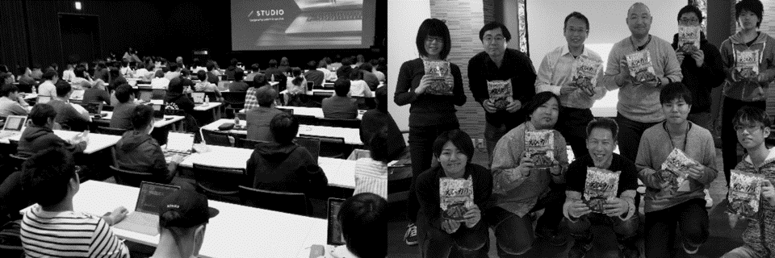
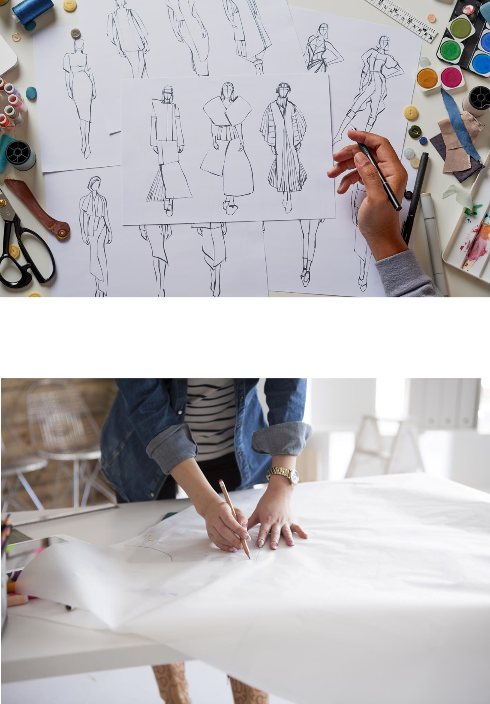

# Part of Coding
##  1st week

---

- 10:05～ ANY課題について
- 10:10～ アイスブレイク
- 10:25～ アイスブレイクの発表
- 10:40～ 制作の心構え
- 10:45～ HTMLの話
- 11:05～ 構想してきたもの
- 11:10～ こんな風に書いてほしい
- 11:15～ 実習
- 11:45～ 来週に向けて

---

## ANY課題について

---

## アイスブレイク

---

### 目玉焼きを美味しく焼き上げて！

---

- 使っていいHTMLの要素は**3つまで**
- CSSはHTMLファイルに直書き
- 美味しそうになるように ← これ大事

10:25まで

---

- 美味しそうなポイントは
- どんな工程で作ったか
- 苦労した点

---

## 制作の心構え

---

- カンプを見て作業前にHTML、CSSを考える（JSもね） ← これができないと質問できない
- 技術に関して、基本的にわからないことはググる、自分で調べる
Copilotデモ
- 対象ブラウザが何かは絶対確認

---

### このサイトだけは覚えておこう

#### Can I use  
https://caniuse.com/

#### MDN  
https://developer.mozilla.org/ja/docs/Web

---

## HTMLの話

---

### HTMとは何か

---

### アウトラインを理解する

---

### LINT

#### W3C Markup Validation Service
https://validator.w3.org/

---

## 宿題

---

11:05 構想してきたもの
といってもむずかしいかもしれないけども

---

## こんな風に書いてほしい

---

## 実習

---

## 来週に向けて

---

## 講師の自己紹介

---

### 小泉 誠 
- Webデザイナー・UI/UXデザイナー
- フロントエンドエンジニア
- 集客やIT化コンサルタント etc.

  

---

「Studio FireColor」という屋号で、フリーランスとして活動中。ウェブ制作会社、システム会社、SEO系の会社などで10年 以上の経験をつみ独⽴。 
独⽴から10年⽬（2021年現在）

Webデザイナーに始まりフロントエンド全般、SEO、 マーケティング、システム開発、集客や社内のIT化のコンサルティングなど。 
現在は「本⼈も職種がわからない…」といった感じで、 ゼネラリスト道を邁進中。

---

- 代理店経由で大手企業の仕事が5割
- 元請で中小企業中心に5割

---

---

### activities
IT分野での活動

---

  

- Web系の勉強会の主宰やスタッフ
- Web技術の講師
- 高校教員の情報技術研修
- 子供向けプログラミング教育ボランティア

---

## コーディングとは何か

---

コード≒プログラム  
を  
書いていくこと

---

DESGIN CAMPUSでは  
主に  
HTML・CSS・JavaScript

---

---

    

    
XDやPSなどはデザイン画や型紙を作る作業

---

    
コーディングは実際の服を作る縫製

    

---

### コーディングは手段であり道具

---

どんな道具があって  
その道具はどうやって使うのか

---

例えば今主流の  
レスポンシブウェブデザイン

---

  

[https://poika.tokyo/](https://poika.tokyo/)

---

- ウェブアプリ・サービス
- マイクロインタラクション
- モーショングラフィック
- インフォグラフィック
- 3Dやゲーム

---

コミュニケーションを円滑にすることも

---

### コーディングができるとここがいい

- デザインの幅、表現が広がる
- デザイナー以外とのコミュニケーションもしやすくなる

---

## DESGIN CAMPUSで学べる事

---

今まさに、現場で使われている技術

---

お疲れ様でした。教室でお会いしましょう！